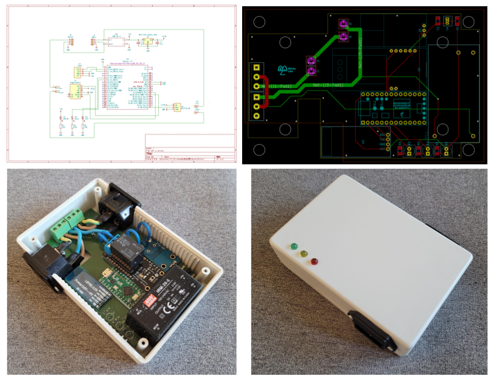

# Blinky Power Relay Cube
The Blinky Power Relay Cube controls a  [Adafruit Power Relay FeatherWing](https://www.adafruit.com/product/3191) which can switch 5Amps at 240V AC. In addition, the cube can measure the AC current using a [ACS712 Current sensor](https://www.electrokit.com/en/product/current-sensor-acs712-5a/). Both the relay and current sensor are controlled by a  [Teensy LC](https://www.pjrc.com/teensy/teensyLC.html) micro-controller. The Teensy LC micro-controller communicates to the [Blinky Power Relay tray](https://github.com/blinky-lite-energy-exchange/blinky-power-relay-tray) with a serial Bluetooth connection very similar to the connection method described in the [Blinky Bus Cube](https://github.com/Blinky-Lite-Exchange/blinky-bus-cube) project.

 
